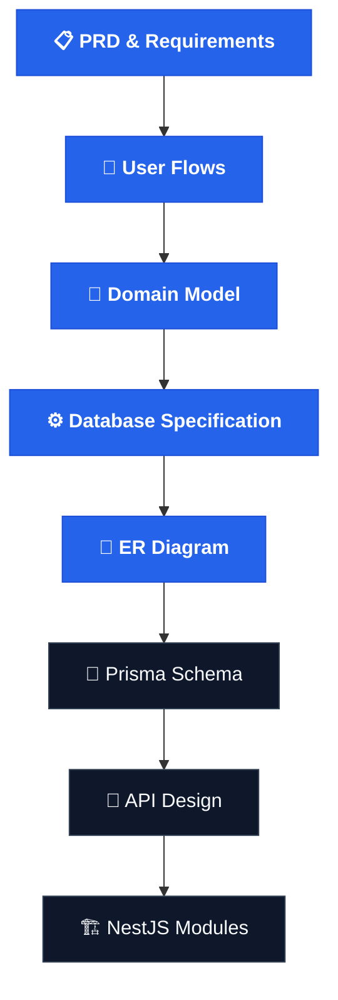
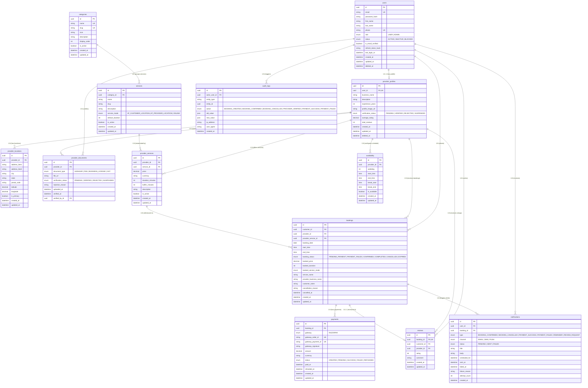
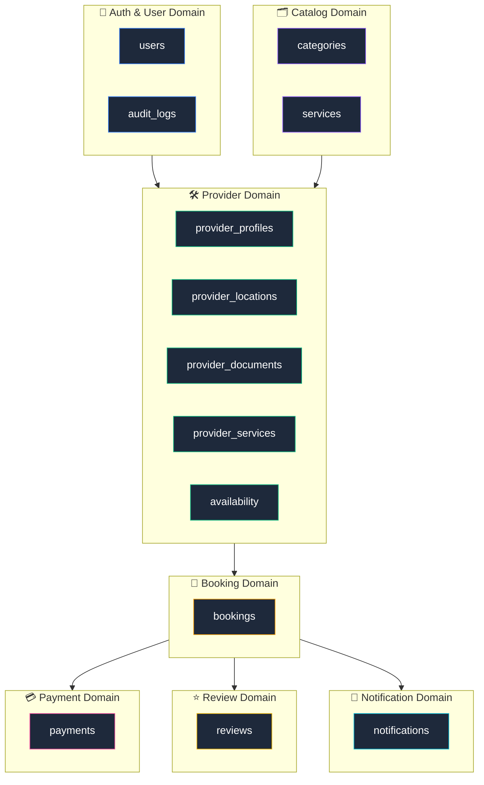
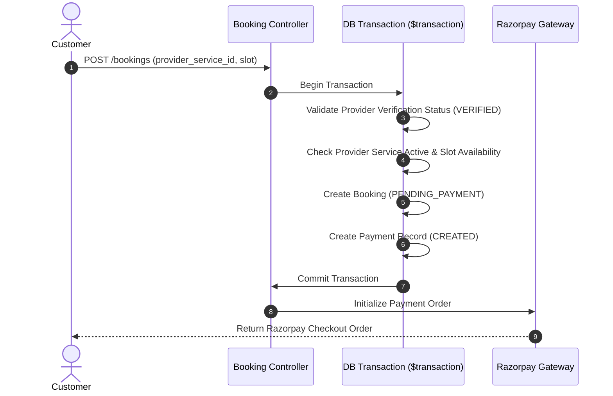
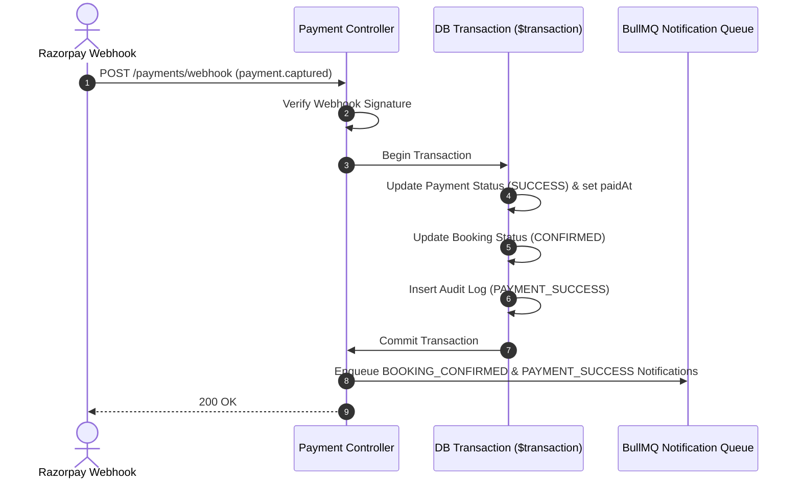

# Entity Relationship (ER) Diagram & Database Specification

> **ServiceHub Platform** — Production-Grade Relational Database Architecture & Module Specifications

---

## 📐 Design Philosophy & Pipeline

Before implementing ORM models in Prisma, defining a clear Entity Relationship (ER) Diagram establishes model contracts, explicit relationship cardinalities, transaction boundaries, and domain boundaries.

---

## 🗂️ Complete ER Diagram

---

## 📊 Cardinality & Relationship Matrix

| Primary Entity | Target Entity | Relationship | Cardinality | FK Location | Description |
| :--- | :--- | :--- | :--- | :--- | :--- |
| **User** | **ProviderProfile** | One-to-Optional-One | `1 : 0..1` | `provider_profiles.user_id` | A user can optionally register as a service provider. |
| **User** | **ProviderDocument** | One-to-Many | `1 : N` | `provider_documents.verified_by_id` | An admin user verifies provider verification documents. |
| **User** | **Booking** | One-to-Many | `1 : N` | `bookings.customer_id` | A customer user places bookings. |
| **User** | **Review** | One-to-Many | `1 : N` | `reviews.customer_id` | A customer writes reviews for completed bookings. |
| **User** | **Notification** | One-to-Many | `1 : N` | `notifications.user_id` | A user receives account and transaction notifications. |
| **User** | **AuditLog** | One-to-Many | `1 : N` | `audit_logs.actor_user_id` | User actions recorded for audit history. |
| **ProviderProfile** | **ProviderLocation** | One-to-Many | `1 : N` | `provider_locations.provider_id` | A provider profile can register multiple operating locations. |
| **ProviderProfile** | **ProviderDocument** | One-to-Many | `1 : N` | `provider_documents.provider_id` | A provider uploads documents for platform verification. |
| **ProviderProfile** | **ProviderService** | One-to-Many | `1 : N` | `provider_services.provider_id` | A provider configures customized pricing/duration for catalog services. |
| **ProviderProfile** | **Availability** | One-to-Many | `1 : N` | `availability.provider_id` | Weekly schedule & break slots configured by provider. |
| **ProviderProfile** | **Booking** | One-to-Many | `1 : N` | `bookings.provider_id` | Bookings assigned to the service provider. |
| **ProviderProfile** | **Review** | One-to-Many | `1 : N` | `reviews.provider_id` | Overall rating & reviews accumulated by provider. |
| **Category** | **Service** | One-to-Many | `1 : N` | `services.category_id` | Category groups standardized service templates. |
| **Service** | **ProviderService** | One-to-Many | `1 : N` | `provider_services.service_id` | Catalog service implemented by multiple providers. |
| **ProviderService** | **Booking** | One-to-Many | `1 : N` | `bookings.provider_service_id` | Customer books a specific provider service offer. |
| **Booking** | **Payment** | One-to-Many | `1 : N` | `payments.booking_id` | Booking can have payment attempts (1 success, multiple attempts). |
| **Booking** | **Review** | One-to-Optional-One | `1 : 0..1` | `reviews.booking_id` | A completed booking can receive at most 1 review. |
| **Booking** | **Notification** | One-to-Many | `1 : N` | `notifications.booking_id` | Triggered notification events linked to a booking lifecycle. |

---

## 🏗️ Domain Bounded Contexts & Module Ownership

Each table belongs strictly to a domain boundary. NestJS modules encapsulate access to their respective database entities to avoid cross-domain coupling.

---

## 🔄 Transaction Boundaries & Data Workflows

Design transactions with explicit boundaries to prevent deadlocks and maintain consistency.

### 1. Booking Creation Transaction Boundary

### 2. Payment Webhook Confirmation Boundary

